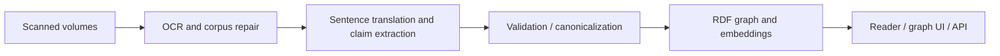

# Konbaung Chronicle Knowledge Graph

**An end-to-end historical research system: Burmese chronicle scans → translated, structured claims → an evidence-linked reader, knowledge graph, and public API.**

I built this project to investigate how power operated in the Konbaung dynasty: through kingship, office, military command, religious patronage, tribute, kinship, and local administration. It turns a large primary source into inspectable research data while preserving the connection between an interpretation and its source sentence and page.

[Live research reader](https://burmeseneuralreader.com/chronicles/vol1/47) · [API documentation](https://burmeseneuralreader.com/api/v1/docs) · [Portfolio](https://github.com/conradcompagna)

## Engineering highlights

- **A complete extraction pipeline:** page-image OCR, sentence reconstruction, translation, structured LLM annotation, schema validation, targeted repair, and corpus compilation.
- **Auditable historical evidence:** canonical page text, source hashes, sentence identifiers, exact Unicode/UTF-16 alignment, cross-page routing, and explicit deduplication.
- **Substantial knowledge representation:** the deployed graph manifest records **27,129 canonical claims across 1,215 pages and three volumes**, with 23,890 entity labels and 11,886 relation labels.
- **Research access and analysis:** embedded Oxigraph/RDF storage, thematic and embedding-based exploration, entity-resolution workflows, an interactive reader, and a versioned read-only API with OpenAPI documentation.

## Pipeline

## Explore the code

| Area | Starting points |
|---|---|
| OCR | `konbaung-google-ocr/src/` |
| Corpus construction | `build_konbaung_sentence_corpus.py`, `repair_konbaung_sentence_corpus.py` |
| Translation and extraction | `konbaung_gemini_sentence_translation_batch.py`, `konbaung_gemini_historiography_ungrounded_full_batch.py`, prompt templates |
| Embeddings and resolution | `konbaung_v3_eight_view_embeddings.py`, `run_konbaung_binary_resolution_production.py` |
| Graph storage | `konbaung_reader_app/graph_schema.py`, `graph_store.py`, `axial_store.py` |
| HTTP and browser interface | `konbaung_reader_app/app.py`, `public_api.py`, `frontend/`, `static/` |
| Validation and research analysis | `tests/`, `konbaung_reader_app/tests/`, `article/` source scripts |

The repository includes research trials and earlier annotation pipelines as well as the deployed reader. They record distinct methodological experiments; the README's graph counts refer to the canonical V3 dataset. Extracted claims and semantic clusters are model-assisted research outputs, not a human-coded gold standard or proof of historical truth.

**This repository publishes the software, not the proprietary research dataset.** RDF/N-Quads files, Oxigraph storage, extracted triples, corpus exports, embedding matrices, and generated analytical outputs are excluded. The public application's existing API is a separate interface; no dataset license is granted here.

See [setup and external resources](docs/SETUP.md), [publication contents](docs/PUBLICATION.md), and [third-party notices](THIRD_PARTY_NOTICES.md).
