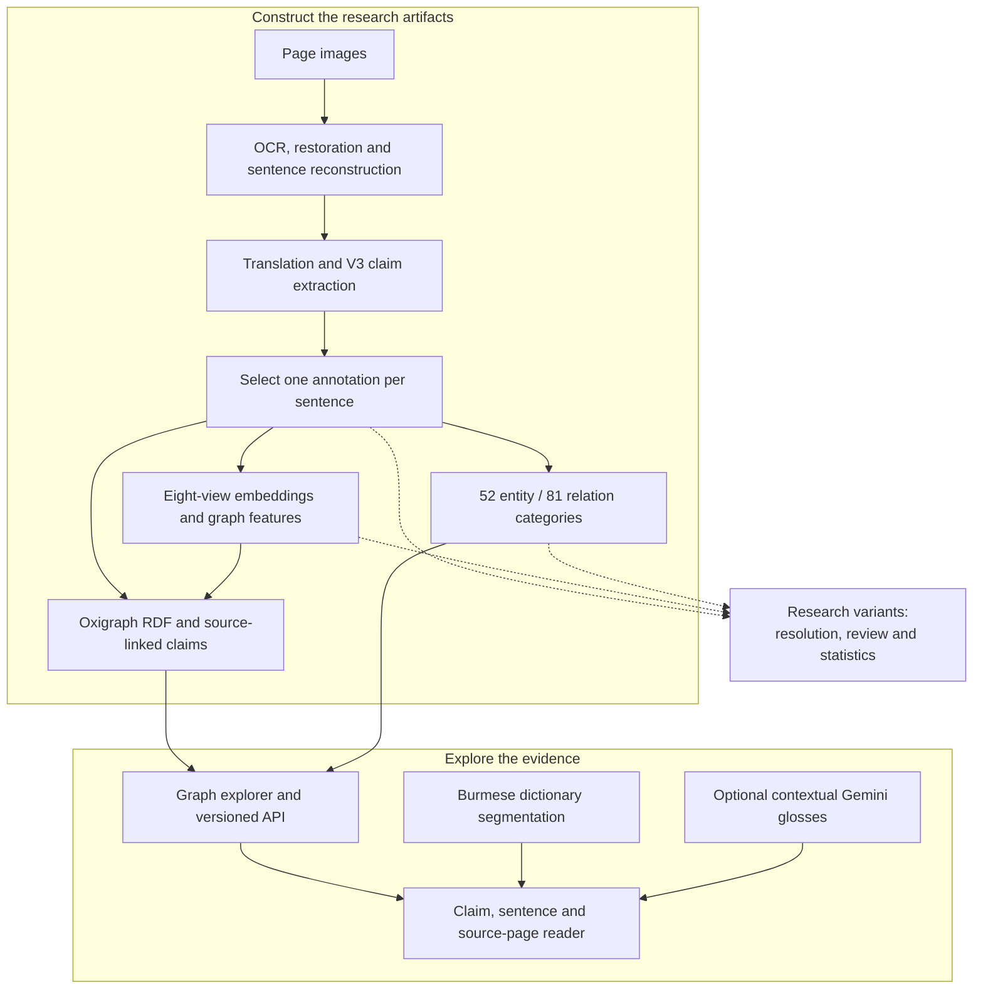

# Konbaung Chronicle Knowledge Graph

**An end-to-end historical research system: Burmese chronicle scans → structured claims → an evidence-linked reader, knowledge graph, and public API.**

I built this project to investigate how power operated in the Konbaung dynasty through kingship, office, military command, religious patronage, tribute, and kinship. It turns a large primary source into inspectable research data while connecting interpretations to their source sentences and pages.

The work spans OCR and source restoration, sentence reconstruction, translation,
structured claim extraction, embedding and category construction, and an RDF graph
with an interactive reader and API. I developed the accompanying resolution,
review and statistical-analysis workflows to connect computational results back
to historical questions and source evidence.

The source-processing scripts, prompts, build manifests, analysis logs and findings
below document how I developed the system and used it in my research.

## From source pages to exploration

Offline builds create the data used by the reader; opening the graph does not
rerun extraction or embedding generation. Research branches record their own
versioned input snapshots. The
[construction and version guide](docs/BUILD_PROCESS.md) connects the served
artifacts to their builders, hashes and research branches.

## Engineering highlights

- **Complete extraction infrastructure:** page-image OCR, sentence reconstruction, translation, structured LLM annotation, schema validation, targeted repair, and corpus compilation.
- **Traceable evidence:** canonical page text, source hashes, sentence identifiers, exact Unicode/UTF-16 span alignment, cross-page routing, and deduplication.
- **Substantial knowledge representation:** the deployed manifest records **27,129 canonical claims across 1,215 pages and three volumes**, with 23,890 entity labels and 11,886 relation labels.
- **Research access and analysis:** embedded Oxigraph/RDF storage, embedding-based exploration, entity-resolution workflows, a worker-based graph interface, and a versioned read-only API with OpenAPI documentation.

## Explore the code

| Stage | Starting point |
|---|---|
| OCR | [konbaung-google-ocr/src/](konbaung-google-ocr/src/) |
| Corpus reconstruction and compilation | [pipeline/corpus/](pipeline/corpus/) |
| Translation and claim extraction | [pipeline/translation/](pipeline/translation/), [pipeline/extraction/](pipeline/extraction/), [prompts/](prompts/) |
| Embeddings and entity resolution | [pipeline/embeddings/](pipeline/embeddings/), [pipeline/resolution/](pipeline/resolution/) |
| Graph storage and API | [graph_store.py](konbaung_reader_app/graph_store.py), [public_api.py](konbaung_reader_app/public_api.py) |
| Reader and graph interface | [app.py](konbaung_reader_app/app.py), [frontend/](konbaung_reader_app/frontend/) |
| Statistical analysis | [research/analysis/](research/analysis/) |

The [pipeline guide](pipeline/README.md) connects these stages, from model-assisted
extraction to source inspection, entity review, and graph exploration. The
[graph interface guide](konbaung_reader_app/frontend/graph/README.md) maps the
frontend by navigation, rendering, filtering, layout, and evidence responsibilities.

---

## How it was built

The research package connects the system's construction to its historical purpose:
examining the relationships among office, command, patronage, tribute, and kinship.
It includes the methods, analysis code, selected findings, figures, and run records.

**[`research/`](research/)** — start at [research/README.md](research/README.md).

| | |
|---|---|
| [**Construction and selected artifacts**](docs/BUILD_PROCESS.md) | The source-to-product story, served V3 snapshots, final categories and evidence by stage. |
| [**Methodology**](research/notes/METHODOLOGY.md) | Corpus construction, extraction design, eight embedding views, and validation. |
| [**Pipeline guide**](pipeline/README.md) | Every stage from page image to canonical graph, and why extraction and resolution are shaped the way they are. |
| [**Analysis run record**](research/reproduce/) | The analysis runner, twelve per-stage logs, output checksums, input provenance, and data validation. |
| [`research/findings/`](research/findings/) | Model comparisons, relation-layer structure, stability estimates, and validation results. |
| [`research/figures/`](research/figures/) | The four figures, PNG and SVG. |
| [`research/experiments/`](research/experiments/) | Schema development across seven annotator generations and targeted-repair strategies. |
| [`research/datasets/`](research/datasets/) | Earlier research-snapshot label distributions; the served V3 graph counts are listed above. |
| [`research/notes/`](research/notes/) | Historical interpretation, statistical methods, and the evaluation record. |

For a short route through the findings, read the
[historical interpretation](research/notes/PRELIMINARY_HISTORICAL_INTERPRETATION.md)
and the [analysis results](research/notes/NEW_ANALYSES_AND_RESULTS.md). The latter
connects each result to its model, source context, and validation checks.
