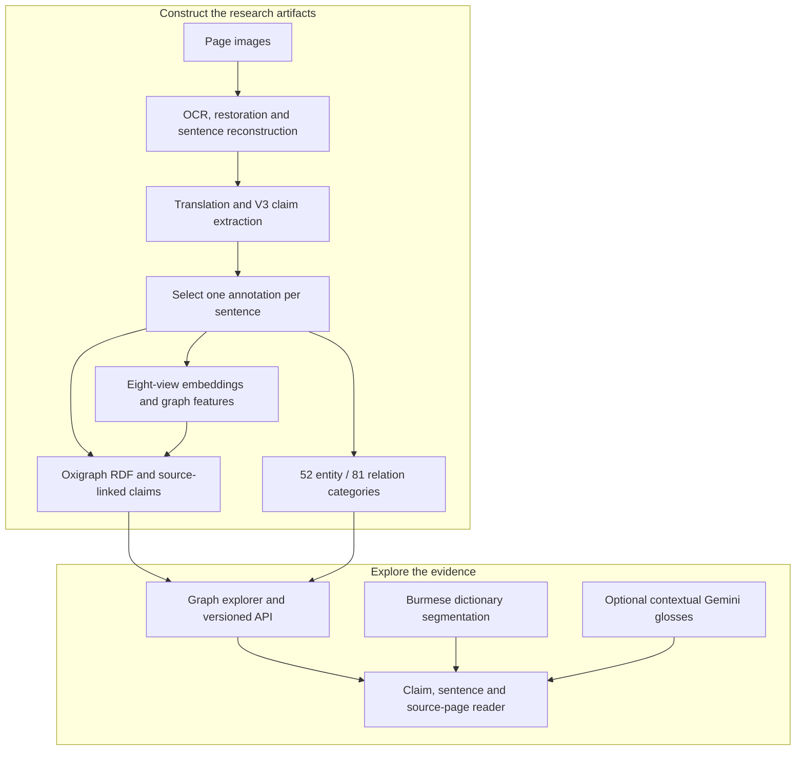

# Konbaung Chronicle Knowledge Graph

**An end-to-end historical research system: Burmese chronicle scans → structured claims → an evidence-linked reader, knowledge graph, and public API.**

I built this project to turn three volumes of the Konbaung Chronicle into a source-linked knowledge graph and dataset. Each structured claim connects to its Burmese sentence, English translation, and source page.

The work spans OCR and source restoration, sentence reconstruction, translation,
structured claim extraction, embeddings, category construction, and an RDF graph
with an interactive reader and API. Entity-resolution tools combine candidate
retrieval, supervised ranking, and manual review.

The scripts, prompts, build manifests, and evaluation records below document
how the graph and dataset were produced.

## From source pages to exploration

```mermaid
flowchart TB
    subgraph Build["Construct the research artifacts"]
        Scans["Page images"] --> OCR["OCR, restoration and sentence reconstruction"]
        OCR --> Extract["Translation and V3 claim extraction"]
        Extract --> Canonical["Select one annotation per sentence"]
        Canonical --> Embeddings["Eight-view embeddings and graph features"]
        Canonical --> Categories["52 entity / 81 relation categories"]
        Canonical --> Graph["Oxigraph RDF and source-linked claims"]
        Embeddings --> Graph
    end
    subgraph Use["Explore the evidence"]
        Graph --> Explorer["Graph explorer and versioned API"]
        Categories --> Explorer
        Explorer --> Reader["Claim, sentence and source-page reader"]
        Burmese["Burmese dictionary segmentation"] --> Reader
        Gloss["Optional contextual Gemini glosses"] --> Reader
    end
```

Offline builds create the data used by the reader; opening the graph does not
rerun extraction or embedding generation. The
[construction and version guide](docs/BUILD_PROCESS.md) connects the served
artifacts to their builders and verified input hashes.

## Engineering highlights

- **Complete extraction infrastructure:** page-image OCR, sentence reconstruction, translation, structured LLM annotation, schema validation, targeted repair, and corpus compilation.
- **Traceable evidence:** canonical page text, source hashes, sentence identifiers, exact Unicode/UTF-16 span alignment, cross-page routing, and deduplication.
- **Substantial knowledge representation:** the deployed manifest records **27,129 canonical claims across 1,215 pages and three volumes**, with 23,890 entity labels and 11,886 relation labels.
- **Graph exploration and access:** embedded Oxigraph/RDF storage, embedding-based exploration, entity-resolution workflows, a worker-based graph interface, and a versioned read-only API with OpenAPI documentation.

## Extraction evaluation

**Provisional LLM-as-judge evaluation** of Gemini annotations across two non-overlapping 5% tranches: **122 pages (10.04% of the corpus), 1,201 sentences and 2,808 triples**. Manual review is in progress.

| Metric | First tranche | Second tranche | Combined |
|---|---:|---:|---:|
| Pages | 61 | 61 | **122** |
| Extracted triples | 1,423 | 1,385 | **2,808** |
| Semantic precision | 96.7% | 96.2% | **96.5%** |
| No-flag precision | 94.1% | 92.8% | **93.4%** |
| Inclusive recall | 92.6% | 92.1% | **92.3%** |
| Full-only recall | 89.4% | 89.2% | **89.3%** |

Semantic precision credits supported triples and soft construction errors; no-flag precision counts only supported triples. Recall measures grouped source relations: inclusive credits full and partial coverage; full-only credits complete coverage. Recall scores use available annotations; including the sampled page with unavailable archive annotations, combined inclusive recall is **91.9%**.

## V3 dataset and embeddings

I have released the canonical V3 claims and source sentences, three embedding
matrices, and entity-resolution tables:
**[Zenodo dataset and DOI](https://zenodo.org/records/22949204)** ·
**[GitHub download](https://github.com/conradcompagna/konbaung-knowledge-graph/releases/tag/data-v3-2026-09-25)**.

The [data guide](research/data-release/README.md) explains the 27,129 claims,
11,282 sentence records, vector row mappings and person-resolution variants;
it includes file checksums, citation metadata and an example that reads a claim
with its source sentence and embeddings.

## Explore the code

| Stage | Starting point |
|---|---|
| OCR | [konbaung-google-ocr/src/](konbaung-google-ocr/src/) |
| Corpus reconstruction and compilation | [pipeline/corpus/](pipeline/corpus/) |
| Translation and claim extraction | [pipeline/translation/](pipeline/translation/), [pipeline/extraction/](pipeline/extraction/), [prompts/](prompts/) |
| Embeddings and entity resolution | [pipeline/embeddings/](pipeline/embeddings/), [pipeline/resolution/](pipeline/resolution/) |
| Graph storage and API | [graph_store.py](konbaung_reader_app/graph_store.py), [public_api.py](konbaung_reader_app/public_api.py) |
| Reader and graph interface | [app.py](konbaung_reader_app/app.py), [frontend/](konbaung_reader_app/frontend/) |

The [pipeline guide](pipeline/README.md) connects these stages, from model-assisted
extraction to source inspection, entity review, and graph exploration. The
[graph interface guide](konbaung_reader_app/frontend/graph/README.md) maps the
frontend by navigation, rendering, filtering, layout, and evidence responsibilities.

---

## How it was built

The [construction records](research/README.md) connect source preparation,
extraction, embeddings, and entity review to the published graph and dataset.

| Record | Contents |
|---|---|
| [Construction and selected artifacts](docs/BUILD_PROCESS.md) | Served V3 snapshots, final categories, and evidence by stage. |
| [Methodology](research/notes/METHODOLOGY.md) | Corpus construction, extraction design, eight embedding views, and validation. |
| [Pipeline guide](pipeline/README.md) | The stages from page images to the graph. |
| [Entity-resolution evaluation](research/notes/ENTITY_RESOLUTION.md) | Candidate retrieval, learned ranking, and manual review. |
| [Extraction experiments](research/experiments/) | Schema development across seven annotator generations and targeted repair strategies. |
| [Label inventories](research/datasets/) | Earlier extraction-snapshot label distributions used in resolution development. |
| [Annotation cost](research/annotation_cost.json) | Recorded token usage and historical cost for a batch extraction pass. |
