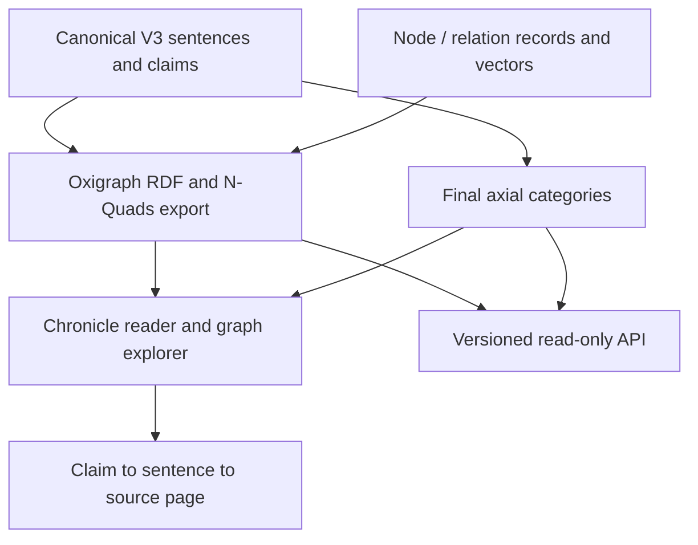

# From chronicle scans to the served graph and research results

I built this system to make a Burmese chronicle usable as inspectable historical
research data: reconstruct the text, extract structured claims, retain the route
back to the source, and provide both interactive exploration and quantitative analysis.

The [selected-artifact record](../research/reproduce/served_artifacts.json) anchors
this account to the deployed graph, canonical annotations and axial-category layer
checked on 23 September 2026. The [methodology](../research/notes/METHODOLOGY.md)
provides the fuller research argument and parameter choices.

## 1. Recover text and stable source identities

[OCR infrastructure](../konbaung-google-ocr/src/) processes page images and records
requests, responses and run summaries. [Corpus reconstruction](../pipeline/corpus/)
then assembles sentences, handles cross-page continuations, repairs text and
integrates restoration annotations. Stable sentence and page IDs connect these
transformations to the reader.

The [source-alignment tests](../tests/unit/) exercise Unicode/UTF-16 offsets,
cross-page routing and source projection with synthetic examples. Earlier extraction
generations also use token/evidence spans; the selected V3 claims use the canonical
sentence as their evidence unit, connected to its source-page appearances.

## 2. Extract and select the V3 claim corpus

[Translation](../pipeline/translation/) and [historiographical extraction](../pipeline/extraction/historiography.py)
turn the reconstructed source into structured sentence-level annotations.
The selected source run is `konbaung_historiography_ungrounded_v3_full_batch_20260723`,
using **Gemini 3.1 Flash Lite**. Its output and report hashes are recorded in the
canonical build provenance.

[build_historiography_v3_reader_data.py](../pipeline/corpus/build_historiography_v3_reader_data.py)
selects one annotation for each sentence appearing on multiple pages, using the
recorded ordering: **greatest triple count → owner page → lowest page number**.
This is canonicalization of repeated sentence annotations, a different operation
from merging historical entities with similar names.

The selected canonical snapshot is `konbaung_historiography_v3_canonical_20260724`:

| Quantity | Meaning |
|---|---|
| **27,129 claims** | Canonical subject–predicate–object claims. |
| **11,222 sentences** | Canonical sentences with selected V3 annotations. |
| **1,215 pages / 3 volumes** | Source-page coverage recorded in the graph manifest. |
| **11,282 sentences** | The broader base sentence corpus, a different denominator from annotated V3 sentences. |

The [schema-development record](../research/experiments/annotator-generations/OUTCOME.md)
preserves earlier extraction and repair designs. Those generations explain the
evolution of the work; their outputs should be identified by version rather than
concatenated into an implied single production pipeline.

## 3. Build embeddings and analytical categories

[v3_eight_view_embeddings.py](../pipeline/embeddings/v3_eight_view_embeddings.py)
builds **768-dimensional Gemini Embedding 2** representations in eight views:
subject, predicate, object and whole triple, each with or without Burmese/English
context. Shared request keys deduplicate repeated material; the retained build
records **151,275 unique embedding requests**.

The [feature and clustering build](../pipeline/embeddings/v3_node_edge_clustering.py)
produces node/relation records and vector matrices used for graph exploration.
The raw graph has **23,890 entity labels and 11,886 relation labels**. Similarity
provides an exploration/review signal; it does not by itself establish that two
labels refer to the same historical person or institution.

The final [axial coding workflow](../pipeline/extraction/flashlite_axial_full_corpus_batch.py)
and [v2 prompt](../prompts/flashlite_axial_coding_prompt_v2.md) add **52 entity
categories and 81 relation categories** over the same 27,129 claims. The served
snapshot is `konbaung_axial_categories_v2`; its manifest records Gemini 3.1 Flash
Lite, prompt version v2.0, input hashes and closed-schema remaps.

### Embedding identity

The embedding build's final report and source manifest are hash-linked to the
feature build, establishing `gemini-embedding-2` for this snapshot. The original
deployed graph manifest retained the older `gemini-embedding-001` label; the
artifact record preserves that historical value alongside the verified build
identity. The published graph builder now labels new exports with Embedding 2.

## 4. Build and serve the evidence-linked graph

[build_graph_database.py](../konbaung_reader_app/build_graph_database.py) constructs
named RDF graphs for schema, source claims, direct relations and embedding metadata.
It checks imported counts, writes a portable N-Quads export and builds an overview.
The served data retains raw entity/relation identities; complete entity-resolution
research waves are not prerequisites for this particular raw V3 graph.

[graph_store.py](../konbaung_reader_app/graph_store.py),
[axial_store.py](../konbaung_reader_app/axial_store.py) and the
[public API](../konbaung_reader_app/public_api.py) provide retrieval and exploration.
The [graph frontend](../konbaung_reader_app/frontend/graph/README.md) separates
navigation, filtering, evidence display and layout-worker responsibilities.

The chronicle reader combines source pages and sentence annotations with an
[adapter to Burmese Neural Reader](../konbaung_reader_app/reader_bridge.py).
That adapter invokes its dictionary segmentation path; contextual Gemini glosses
are a separate optional runtime request. Offline claim extraction and embedding
generation are not repeated whenever a visitor opens the graph.

## 5. Connect the graph work to the research analysis

| Branch | What it contributes | Evidence |
|---|---|---|
| Entity resolution | Candidate retrieval, supervised pair ranking, frequency-prioritized review waves and adjudication | [Resolution code](../pipeline/resolution/), [review code](../pipeline/review/), [case study](../research/notes/ENTITY_RESOLUTION.md). |
| Categorization and semantic analysis | Historical analytical categories, embedding views, clustering and comparisons | [Methodology](../research/notes/METHODOLOGY.md), [selected findings](../research/findings/). |
| Statistical reconstruction | Contingency, network layers, tensors, paths, null models, robustness and prediction | [Analysis source](../research/analysis/), [runner and stage logs](../research/reproduce/README.md), [figures](../research/figures/). |

The analysis package identifies its own input snapshots in
[input_provenance.json](../research/reproduce/input_provenance.json), and records
its outputs in [OUTPUT_CHECKSUMS.sha256](../research/reproduce/OUTPUT_CHECKSUMS.sha256).
Its resolved person networks and category mappings are analytical products with
their own lineage, rather than interchangeable copies of the served raw graph.
The older 5,667-entity/13,727-relation inventory in
[research/datasets](../research/datasets/) belongs to that earlier research record.

## Evidence by stage

| Stage | Engineering work | Record |
|---|---|---|
| Source preparation | OCR requests, restoration, sentence assembly and stable source identities | [OCR source and run evidence](../konbaung-google-ocr/), [corpus builders](../pipeline/corpus/). |
| Claim corpus | Structured extraction, schema evolution and canonical sentence selection | [Extraction modules](../pipeline/extraction/), [V3 reader-data builder](../pipeline/corpus/build_historiography_v3_reader_data.py), [schema-development record](../research/experiments/annotator-generations/OUTCOME.md). |
| Semantic representation | Eight embedding views, vector features and final axial categories | [Embedding builders](../pipeline/embeddings/), [axial workflow](../pipeline/extraction/flashlite_axial_full_corpus_batch.py), [selected artifact identities](../research/reproduce/served_artifacts.json). |
| Graph and reader | RDF assembly, evidence routing, source projection and interactive exploration | [Graph builder](../konbaung_reader_app/build_graph_database.py), [API](../konbaung_reader_app/public_api.py), [frontend](../konbaung_reader_app/frontend/graph/README.md). |
| Research analysis | Entity resolution, review, statistical comparisons and historical interpretation | [Resolution case study](../research/notes/ENTITY_RESOLUTION.md), [findings](../research/findings/), [analysis run record](../research/reproduce/README.md). |

The three served manifest identities and fourteen verified build-input hashes
connect the construction stages to the selected graph and category snapshots.
The [artifact record](../research/reproduce/served_artifacts.json) records the
scope of that verification; the analysis package has its own input provenance,
stage logs and output checksums.
