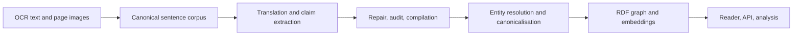

# Pipeline guide

Run modules from the repository root. For example,
`python -m pipeline.extraction.historiography_batch --help` and
`python -m pipeline.translation.sentence_translation_batch --help` describe the batch
interfaces.

| Directory | What it does | Representative entrypoints |
|---|---|---|
| `corpus/` | reconstructs sentences from OCR text, repairs them, integrates manual restorations, detects section breaks | `build_sentence_corpus.py`, `repair_sentence_corpus.py`, `build_dataset_v3.py`, `integrate_restoration_annotations.py`, `section_break_detector.py` |
| `translation/` | sentence and evidence translation | `sentence_translation_batch.py`, `evidence_translation_batch.py`, `translated_sentence_triples_batch.py` |
| `extraction/` | claim extraction, open and axial coding, and the targeted repair passes | `historiography_batch.py`, `structured_open_coding_batch.py`, `summary_gap_batch.py`, `quantitative_fourth_pass_batch.py`, `predicate_gloss_repair_batch.py`, `cross_page_repair.py` |
| `audit/` | decides what counts as a defect and measures coverage | `audit_entity_resolution_completion.py`, `calculate_debris_adjusted_coverage.py`, `make_normalized_diff.py`, `audit_v2_removals.py` |
| `embeddings/` | eight-view embeddings, clustering, cluster labelling | `v3_eight_view_embeddings.py`, `v3_node_edge_clustering.py`, `extract_fasttext_tag_token_vectors.py` |
| `resolution/` | collapses the open label inventory into canonical entities | `run_binary_resolution_production.py`, `run_frequency_prioritized_resolution.py`, `run_nonsingleton_top50_wave.py`, `run_remaining_singleton_completion.py`, `pair_classifier/` |
| `review/` | packages candidate merges and evidence for manual adjudication | `build_master_positive_resolution_review.py`, `build_manual_review_archive.py`, `build_analysis_package.py` |

Prompts are in `../prompts/`, with the reference annotations they were scored against
in `../prompts/gold_standards/`. The reader and graph builders are under
`../konbaung_reader_app/`. The statistical analysis is under `../research/`.

## The shape of the work

Two stages carry most of the difficulty.

**Extraction is iterative, not a single pass.** A page goes through open coding, then
gap-filling for claims the first pass missed, then a quantitative pass, then predicate
grounding, then metadata enrichment — with an audit between passes deciding what still
needs work. `extraction/` and `audit/` are interleaved by design. Seven superseded
generations of the annotator are in
[`../research/experiments/annotator-generations/`](../research/experiments/annotator-generations/),
and the sequence of what each one fixed is the clearest statement of why the current
schema looks the way it does.

The accompanying analytical taxonomy was also revised through sampled review:
round five examined 1,357 previously unreviewed triples across 750 pages, adding a
category for private appropriation of public authority and merging categories whose
distinctions did not hold up in context. The sample informed the revision rather
than serving as an independent final test. For extraction, the
[translated-sentence batch driver](translation/translated_sentence_triples_batch.py)
combined batch requests with explicit prefix caching; one recorded pass processed
31.5 million tokens, including retries/salvage, at an estimated historical cost of
$13.73. The [sampling and cost excerpts](../research/findings/pipeline_development.json)
retain the seed, category decisions, token accounting, pricing assumptions, and
source hashes.

**Resolution is a wave process.** The extraction produces an open vocabulary — 5,667
entity labels and 13,727 relation labels, most occurring once
([distributions](../research/datasets/)). Canonicalising it runs in frequency-ordered
waves: the most frequent labels first, where the evidence is richest and a wrong merge
is most costly, then non-singleton labels, then the singleton tail. `resolution/` holds
the wave drivers, the embedding and regex candidate generators, the pair classifier,
and the manual adjudication path. `run_binary_resolution_production.py` is the
production driver and imports the frequency-prioritised trial module, which is why that
module is published here rather than treated as an experiment.

Each stage declares its expected inputs and output directories. Provision the selected
corpus and configure your own API credentials before running a stage. Extraction,
translation, embeddings and classification commands can issue paid requests. These
modules represent separate research stages and methods, not one command that recreates
the proprietary dataset.
