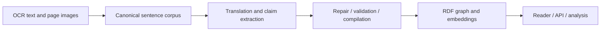

# Pipeline guide

Run modules from the repository root. For example, `python -m pipeline.extraction.historiography_batch --help` and `python -m pipeline.translation.sentence_translation_batch --help` describe the batch interfaces.

| Directory | Representative entrypoints |
|---|---|
| `corpus/` | `build_sentence_corpus.py`, `repair_sentence_corpus.py`, `build_dataset_v3.py`, `build_historiography_v3_reader_data.py` |
| `translation/` | `sentence_translation_batch.py`, `evidence_translation_batch.py` |
| `extraction/` | `historiography_batch.py`, structured annotation and axial-coding stages |
| `embeddings/` | `v3_eight_view_embeddings.py`, clustering and cluster-labeling stages |
| `resolution/` | `run_binary_resolution_production.py`, candidate generation, adjudication, refinement, and `pair_classifier/` |

Prompts live in `../prompts/`. The canonical reader and graph builders are under `../konbaung_reader_app/`; the reusable statistical analysis scripts are under `../research/analysis/`.

Each stage declares its expected inputs and output directories. Provision the selected corpus and configure your own API credentials before running a stage. Extraction, translation, embeddings, and classification commands can issue paid requests. The modules represent separate research stages and methods, not one command that recreates the proprietary dataset.
