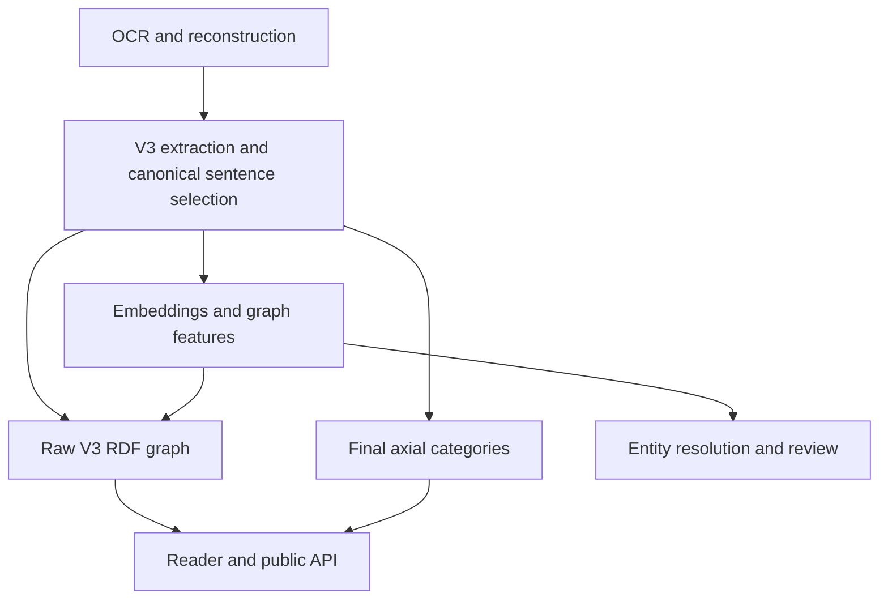

# Pipeline

Code for each stage from page images to the graph.

```mermaid
flowchart TB
    OCR["OCR and reconstruction"] --> Canonical["V3 extraction and canonical sentence selection"]
    Canonical --> Features["Embeddings and graph features"]
    Canonical --> Categories["Final axial categories"]
    Canonical --> Graph["Raw V3 RDF graph"]
    Features --> Graph
    Graph --> Reader["Reader and public API"]
    Categories --> Reader
    Features --> Resolution["Entity resolution and review"]
```

The snapshots used by the deployed graph are listed in
[`../docs/BUILD_PROCESS.md`](../docs/BUILD_PROCESS.md). Entity resolution is a separate
curation step; the served V3 graph uses the unresolved labels.

Batch entrypoints such as `extraction/historiography_batch.py` and
`translation/sentence_translation_batch.py` coordinate requests, intermediate
outputs and progress records for their respective stages.

| Directory | What it does | Representative entrypoints |
|---|---|---|
| `corpus/` | reconstructs sentences from OCR text, repairs them, integrates manual restorations, detects section breaks | `build_sentence_corpus.py`, `repair_sentence_corpus.py`, `build_dataset_v3.py`, `integrate_restoration_annotations.py`, `section_break_detector.py` |
| `translation/` | sentence and evidence translation | `sentence_translation_batch.py`, `evidence_translation_batch.py`, `translated_sentence_triples_batch.py` |
| `extraction/` | claim extraction, open and axial coding, and the targeted repair passes | `historiography_batch.py`, `structured_open_coding_batch.py`, `summary_gap_batch.py`, `quantitative_fourth_pass_batch.py`, `predicate_gloss_repair_batch.py`, `cross_page_repair.py` |
| `audit/` | decides what counts as a defect and measures coverage | `audit_entity_resolution_completion.py`, `calculate_debris_adjusted_coverage.py`, `make_normalized_diff.py`, `audit_v2_removals.py` |
| `embeddings/` | eight-view embeddings, clustering, cluster labelling | `v3_eight_view_embeddings.py`, `v3_node_edge_clustering.py`, `extract_fasttext_tag_token_vectors.py` |
| `resolution/` | collapses the open label inventory into canonical entities | `run_binary_resolution_production.py`, `run_frequency_prioritized_resolution.py`, `run_nonsingleton_top50_wave.py`, `run_remaining_singleton_completion.py`, `pair_classifier/` |
| `review/` | packages candidate merges and evidence for manual adjudication | `build_master_positive_resolution_review.py`, `build_manual_review_archive.py` |
| `scripts/` | PowerShell helpers for entity disambiguation and fastText checks | `run_final_entity_disambiguation.ps1` |

Prompts are in `../prompts/`, with the reference annotations they were scored against
in `../prompts/gold_standards/`. The reader and graph builders are under
`../konbaung_reader_app/`. Construction and evaluation records are under `../research/`.

## Extraction passes

Extraction runs in several passes: open coding, gap-filling for claims the first pass
missed, a quantitative pass, predicate grounding, and metadata enrichment, with an
audit between passes (`audit/`) identifying records that need repair. Earlier annotator
versions are in [`../research/experiments/annotator-generations/`](../research/experiments/annotator-generations/).

The [translated-sentence batch driver](translation/translated_sentence_triples_batch.py)
used batch requests with prefix caching. One pass processed 31.5 million tokens,
including retries, at an estimated cost of $13.73
([token record](../research/annotation_cost.json)).

## Entity resolution

The earlier extraction snapshot has 5,667 entity labels and 13,727 relation labels;
2,685 of the entity labels and most relation labels occur once
([distributions](../research/datasets/)). Resolution runs in
frequency-ordered waves: the most frequent labels first, then non-singleton labels,
then the singletons. `resolution/` holds the wave drivers, the embedding and regex
candidate generators, the pair classifier and the manual adjudication path.
`run_binary_resolution_production.py` is the production driver.
