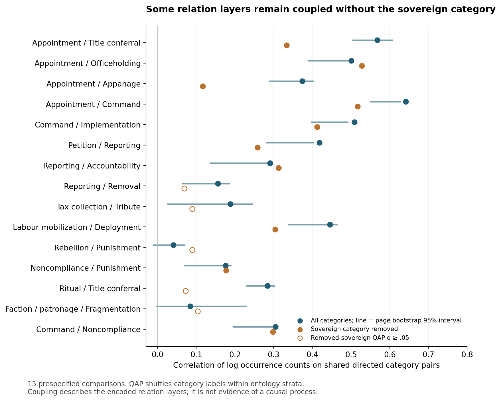
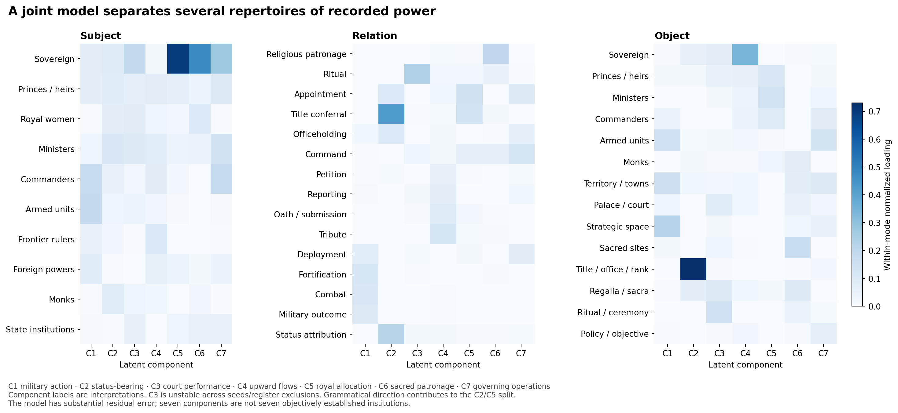
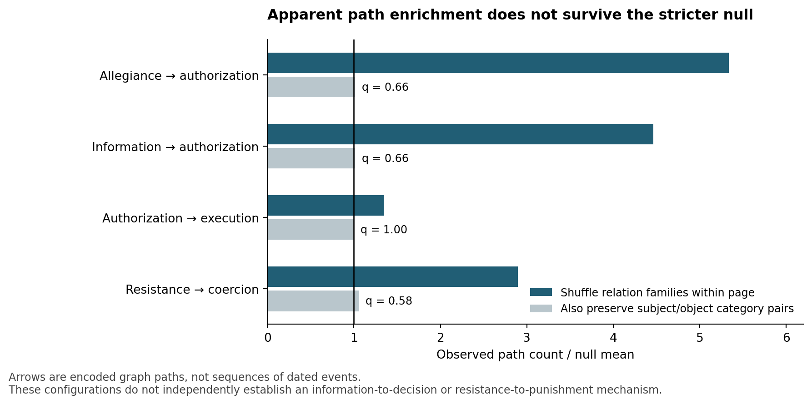
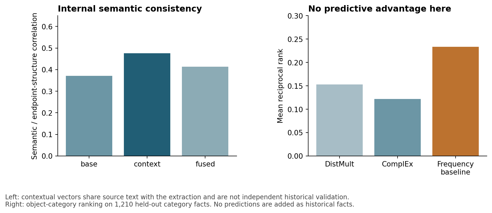

# New analyses of power relations in the Konbaung triples

> Moved here from the September 2026 analysis run directory. Relative references
> below have been repointed at the published copies in `../findings/`,
> `../figures/` and `../reproduce/`. References marked *not published* are to
> full analysis outputs that stay local; see [../README.md](../README.md) for what
> is published and why.

The new analyses support **differentiated but connected forms of power in the chronicle**. Royal allocation, status-bearing, military operations, upward information/resource flows and religious patronage have distinguishable structures. Important layer associations remain after removing the sovereign category. The stronger claim that these form recurrent causal chains is not supported by the stricter motif nulls or the sparse held-out rule results.

## Data and units

The verified source has **27,129 canonical triple occurrences**, **11,282 sentence/translation records**, **10,498 triple-bearing sentences**, **23,890 distinct entity strings**, **11,886 predicate strings**, **52 entity categories** and **81 relation categories**. There are 1,215 annotation pages and 1,206 owner pages with triples. Sixty sentences lack canonical V3 annotation and have not been filled with invented claims.

Three objects are kept distinct: directed graphs of **analytical categories**, the earlier conservative **named-person undirected graph**, and **exact-tag graphs scoped within an owner page**. The 52/81 axial categories are supervised analytical codes assigned by a model; the embedding-derived semantic communities are separate exploratory products. A category such as Sovereign is not one person; an identical title string is not necessarily one person. Subject/object direction is the extractor's grammatical/semantic encoding, and has not been globally converted into grantor-to-recipient direction. Foreign and rival polities mentioned by the chronicle are included. Thus the broad patterns concern the recorded political world, not exclusively Konbaung officeholders.

All resampling uses fixed seeds. Where used for new inference, pages stay together or permutations are explicitly constrained. P-values describe the chosen randomization/model, not the probability that a historical claim is true. Related tests receive BH correction within the stated test family. The analyses are exploratory and were not preregistered; the 15 focal layer pairs and seven motif families were fixed in code before their tests were run.

## 1 Three-way organization exceeds marginal frequencies

The complete S × P × O table has 6,050 occupied category combinations. Three nested expected-count specifications were fitted:

| model | G2 | iterations | max_margin_error | converged |
|---|---|---|---|---|
| mutual_independence | 1.28e+05 | 1 | 4.911e-11 | True |
| S_independent_O_given_P | 2.851e+04 | 1 | 9.095e-13 | True |
| all_pairwise_no_threeway | 1.899e+04 | 996 | 0.0009998 | True |

The all-pairwise fit controls the SP, PO and SO margins. Iterative proportional fitting reached an absolute marginal discrepancy below **0.001 occurrence**. The largest residuals often belong to singletons with tiny expectations; they are not treated as headline discoveries. The following repeated cells have observed counts at least 20 and expected counts at least 5:

| S | P | O | observed | expected_all_pairwise | observed_expected |
|---|---|---|---|---|---|
| E07 | R11 | E08 | 48 | 15.92 | 3.015 |
| E01 | R64 | E30 | 97 | 45.46 | 2.134 |
| E05 | R11 | E40 | 21 | 6.163 | 3.407 |
| E01 | R68 | E01 | 22 | 7.411 | 2.968 |
| E01 | R46 | E26 | 73 | 44.37 | 1.645 |
| E01 | R17 | E08 | 21 | 8.636 | 2.432 |
| E02 | R14 | E24 | 62 | 36.82 | 1.684 |
| E03 | R14 | E24 | 62 | 38.56 | 1.608 |
| E01 | R65 | E41 | 30 | 15.86 | 1.891 |
| E07 | R13 | E08 | 118 | 86.52 | 1.364 |
| E01 | R60 | E25 | 90 | 63.84 | 1.41 |
| E02 | R18 | E03 | 123 | 92.68 | 1.327 |

For example, commander × appointment/delegation × armed unit has **48 occurrences versus 15.92 expected**, about **3.02 times expected** after all pairwise margins. Ministers × assignment × policy/objective has **21 versus 6.16**. These are candidate institutional specializations, not individually significant cells: the displayed ratios and Pearson residuals are descriptive and are not leverage-studentized residuals.

An independent randomization shuffled object categories **within owner page and predicate**, preserving SP/PO and page endpoint margins. The global conditional S–O statistic was **G² = 28,506.86**, compared with null mean **25,810.99**, with one-sided **p = 0.0005** across 1,999 draws. This tests endpoint association given predicate/page; it **does not isolate a three-way interaction after controlling SO**. No sparse-table asymptotic chi-square p-value is reported.

Source checks clarify the meaning. `vol2_s003750` describes a minister and commander being assigned to supervise canal restoration; `vol3_s002648` assigns tax collection and fiscal oversight to named ministers. In the military cell, `APPOINTED_AS_LEADER_OF` and `APPOINTED_BY_KING_TO_COMMAND` encode an officer linked to a unit, not necessarily an officer independently appointing troops. Royal women and princes also have overrepresented appanage-to-territory associations; `vol1_s003103` explicitly connects Ratanamahe's reporting to title, palace position and the Kyaukmaw fief. These passages support differentiated assignments and benefits, while constraining claims about who initiated them.

## 2 Relation layers remain connected beyond the king

All 81 layers were measured on the same 52 categories. The 3,240 pairwise descriptive comparisons are separate from the 15 focal inferential comparisons. QAP correlates log occurrence counts on corresponding directed category pairs; 1,999 permutations relabel one layer within four explicit ontology strata.

| r1 | r2 | observed_all | q_two_sided_all | observed_no_sovereign | q_two_sided_no_sovereign |
|---|---|---|---|---|---|
| R11 | R12 | 0.5677 | 0.0015 | 0.3333 | 0.001667 |
| R11 | R13 | 0.5008 | 0.0015 | 0.5277 | 0.001667 |
| R11 | R14 | 0.3742 | 0.0015 | 0.1164 | 0.0345 |
| R11 | R23 | 0.6413 | 0.0015 | 0.5167 | 0.001667 |
| R23 | R24 | 0.5088 | 0.0015 | 0.4119 | 0.001667 |
| R25 | R26 | 0.4182 | 0.0015 | 0.2582 | 0.001667 |
| R26 | R29 | 0.2909 | 0.0015 | 0.3127 | 0.001667 |
| R26 | R21 | 0.1559 | 0.01962 | 0.06896 | 0.09115 |
| R33 | R34 | 0.1883 | 0.0015 | 0.08929 | 0.07091 |
| R36 | R44 | 0.4453 | 0.0015 | 0.3038 | 0.001667 |
| R54 | R52 | 0.04056 | 0.339 | 0.08944 | 0.08 |
| R76 | R52 | 0.1758 | 0.0075 | 0.177 | 0.001667 |
| R09 | R12 | 0.2843 | 0.0075 | 0.07269 | 0.325 |
| R72 | R73 | 0.08422 | 0.06 | 0.1036 | 0.09429 |
| R23 | R76 | 0.3046 | 0.0015 | 0.2981 | 0.001667 |

Appointment–officeholding and command–implementation remain strongly associated after E01 is removed. Reporting–removal, ritual–titling and tax–tribute do not retain the same corrected support after that removal. This distinction is more informative than a blanket assertion that everything forms one royal power network. Association surviving exclusion does not imply actor autonomy or successful command transmission.

The page-bootstrap bars are percentile ranges of 999 within-volume page resamples; they describe resampling variability and can be biased for this sparse, nonlinear statistic. QAP supplies the reported inferential comparison. Register exclusion and exclusion of both E01 and E30 are separate sensitivity tables. Undefined correlations receive no p-value.

## 3 Joint factors distinguish recurring repertoires

Nonnegative CP was fitted to square-root counts, with ranks 3, 5 and 7 and two starting seeds compared on withheld pages. Rank 7 gave the lowest selection-set negative log likelihood, about **9.596 per claim**, versus **9.914** for a marginal-independence baseline. Because that holdout selected the rank, it is a selection diagnostic rather than an unbiased final test score. The full-data relative reconstruction error is **0.681**, so considerable structure remains unexplained. A Tucker 8 × 8 × 8 fit is also supplied.

The seven fitted components were interpreted as military action, status-bearing, court performance, upward flows, royal allocation, religious patronage and governing operations. Their factor loadings, not these labels, are the primary outputs.

The military, upward-flow, royal-allocation and governing components recur strongly in the alternate-seed and register-exclusion fits. The court-performance component **does not**: its cross-fit similarity is only about 0.14 by seed and 0.11 after register exclusion. Its boundaries should not be treated as established. Religious patronage is moderately stable. Excluding R12 and R64 still leaves recognizable military, upward-flow, allocation and patronage components. The status-bearing/royal-allocation distinction partly reflects receive versus bestow encoding; it is not itself evidence that the model discovered a new institutional duality.

The four-mode fit adds the 12 reign/crisis segments, scaling each segment to occurrences per 1,000 claims. It is an exploratory map of changing textual composition. It does not reconstruct event hazards, reign durations, or continuous political evolution.

## 4 Labelled paths are real configurations but not established mechanisms

Within owner pages, the raw exact-tag graph has **26,550 unique non-self labelled edges**, **18,228 two-edge paths**, **526 transitive edge configurations** and **108 oriented cyclic configurations**. Predicate families were specified as authorization, execution, information, coercion, resistance, allegiance and other.

Weak nulls shuffling labels within pages make several paths look strongly enriched. But preserving the ordered subject/object category pair within each page removes the corrected support for the focal patterns:

| pattern | observed | null_mean | p_greater | q_greater |
|---|---|---|---|---|
| authorization -> execution | 773 | 774 | 0.5745 | 0.9965 |
| information -> authorization | 581 | 574.2 | 0.0745 | 0.658 |
| resistance -> coercion | 117 | 110.9 | 0.047 | 0.5757 |
| allegiance -> authorization | 1719 | 1696 | 0.0905 | 0.658 |

These results show that the apparent paths can largely follow from who tends to send and receive each type of relation. Of information-to-authorization paths, **89.3%** have the sovereign category as intermediate; for allegiance-to-authorization it is **96.5%**. Counting each supporting page once yields the same negative conclusion under the stronger null. The paths are spatial configurations within text pages, not time-respecting event sequences.

The separate unlabelled category triad test uses 1,000 saved draws in two directed-degree-preserving MCMC chains, with symmetric edge-switch proposals, triangle reversals and rejection self-loops. Degree invariants and triad totals pass. Several triads differ from that null, but these are category-graph structure diagnostics. The saved chain means and autocorrelations should accompany any use of their significance profiles; sampling is approximate and complete mixing is not guaranteed.

## 5 Rule mining supplies few generalizable rules

One-edge implications and length-two Horn rules were enumerated with page-scoped entities. Supports count distinct page/subject/object bindings. Standard confidence, head coverage and PCA confidence are explicit. A training support of at least three bindings leaves only six length-two candidates:

| body1 | body2 | head | train_support | train_pages | train_confidence | test_body_pairs | test_support | test_confidence |
|---|---|---|---|---|---|---|---|---|
| R18 | R18 | R18 | 7 | 1 | 0.09589 | 6 | 1 | 0.1667 |
| R12 | R69 | R69 | 5 | 1 | 0.2174 | 0 | 0 | — |
| R15 | R64 | R12 | 4 | 1 | 0.3077 | 1 | 0 | 0 |
| R23 | R24 | R05 | 3 | 1 | 0.1667 | 7 | 0 | 0 |
| R11 | R46 | R44 | 3 | 3 | 0.1071 | 4 | 1 | 0.25 |
| R49 | R46 | R46 | 3 | 3 | 0.08108 | 2 | 0 | 0 |

Most are concentrated on one training page; held-out support is usually zero. For the assignment–fortification–deployment rule (R11/R46/R44), there are three training supporting bindings across three pages and one supporting test binding among four test body pairs. That is a source-reading lead, not a general historical law. A high PCA confidence based on a tiny denominator does not override this limitation. Every rule and its candidate passages remain available, including failures.

## 6 Graph position and statistical network models

The conservative archived named-person graph contains **599 nodes, 443 edges and 162 components**; its largest component contains **64 nodes**. It has **427 bridges**. Additional paths, betweenness and articulation measures are supplied, but this fragmentation is also a statement about extraction and conservative identity resolution. It is not evidence that actual Konbaung society was disconnected.

Category-level analyses add Burt constraint/effective size, Gould–Fernandez brokerage, degrees and centralities, communities, reachability, flow hierarchy, generalized trophic levels, cores, rich club and nestedness. Quantities such as current flow, hitting time, inverse-frequency distance and minimum cuts are mathematical graph diagnostics, not historical quantities of influence, money, travel time or coercive capacity.

For 30 actor/organization categories, the regularized p1 model estimates recorded directed adjacency with sender, receiver and reciprocity terms. Held-out dyad negative log likelihood falls from **1.384** for density alone to **0.876** for sender/receiver effects and **0.850** after reciprocity. The fitted reciprocity multiplier is about **3.63**, conditional on this category model. This is not a causal ERGM of historical people. A coordinate-ascent Bernoulli SBM selects three blocks under its explicit description-score penalty; sparse categories group together partly because of observability. Model adequacy simulations and all candidate partitions are supplied.

## 7 Semantics agree with structure but learned completion adds no advantage

The relation base/context/fused centroids correlate with endpoint-structure similarity by **0.371 / 0.476 / 0.414**. QAP remains positive within broad relation domains and in a Freedman–Lane residual QAP controlling frequency difference and shared raw predicates. The nine tests have corrected q = 0.001 at the current permutation resolution. This is internal agreement between model-assisted descriptions of the same corpus, not independent historical validation; contextual embeddings contain the source sentences from which the triples were extracted.

On a separate split of 6,050 distinct category facts, the 1,210 test facts are disjoint from training and validation. DistMult and ComplEx both underperform the predicate–object frequency baseline:

| model | filter | MRR | hits1 | hits10 | facts |
|---|---|---|---|---|---|
| DistMult | all_other_known_category_facts | 0.3174 | 0.1802 | 0.6298 | 1210 |
| DistMult | unfiltered | 0.1532 | 0.04628 | 0.3992 | 1210 |
| ComplEx | all_other_known_category_facts | 0.2713 | 0.1388 | 0.5868 | 1210 |
| ComplEx | unfiltered | 0.1216 | 0.02727 | 0.3331 | 1210 |
| predicate_object_frequency | all_other_known_category_facts | 0.3995 | 0.2455 | 0.6702 | 1210 |
| predicate_object_frequency | unfiltered | 0.2335 | 0.09835 | 0.5066 | 1210 |

No predicted fact has been added to the database. This diagnostic does not support deploying more elaborate link prediction to fill gaps in the historical record.

## 8 Reign comparisons are about recorded composition

Adjacent reign/crisis segments were compared with Jensen–Shannon divergence on the complete S-P-O distribution. Pages are permuted within volume, retaining page blocks. Some early comparisons with very little source exposure are null; later comparisons often differ:

| reign1 | reign2 | pages1 | pages2 | observed | q_greater |
|---|---|---|---|---|---|
| Alaungpaya | Naungdawgyi | 203 | 17 | 0.6778 | 0.427 |
| Naungdawgyi | Hsinbyushin | 17 | 103 | 0.7237 | 0.1454 |
| Hsinbyushin | Singu | 103 | 7 | 0.7889 | 0.427 |
| Singu | 1782 succession crisis | 7 | 6 | 0.8813 | 0.06757 |
| 1782 succession crisis | Bodawpaya | 6 | 163 | 0.9027 | 0.022 |
| Bodawpaya | Bagyidaw | 163 | 173 | 0.5884 | 0.00275 |
| Bagyidaw | 1837 succession war | 173 | 33 | 0.7079 | 0.00275 |
| 1837 succession war | Tharrawaddy | 33 | 82 | 0.7564 | 0.00275 |
| Tharrawaddy | Pagan Min | 82 | 43 | 0.6011 | 0.07012 |
| Pagan Min | Mindon | 43 | 209 | 0.6386 | 0.0044 |
| Mindon | Thibaw | 209 | 167 | 0.5728 | 0.00275 |

These contrasts do not distinguish political change from narrative selection, compilation, register composition or extraction differences. The data do not provide complete repeated network states for TERGM/SAOM, or validated office spells for survival analysis.

## Reproduction and inspection

The script order is recorded in [RUN_ANALYSES.ps1](../reproduce/RUN_ANALYSES.ps1). The exact source archive and input hashes are in [original_source_verification.json](../reproduce/original_source_verification.json), [input_provenance.json](../reproduce/input_provenance.json), and the original source manifest. The environment, seeds and **126 passing invariants** are recorded in [11_validation.json](../findings/11_validation.json) and [11_environment.json](../findings/11_environment.json). Four figures are supplied as PNG and SVG. The selected source passages (`results/09_selected_source_passages.csv`, not published) retain Burmese and English; the HTML source reader links them to sentence IDs.

The code uses [TensorLy's documented decomposition routines](https://tensorly.org/dev/modules/api.html) and [NetworkX graph definitions](https://networkx.org/documentation/stable/reference/algorithms/index.html). The rule measures follow the support/standard/PCA-confidence distinctions in the supplied [AMIE reference](https://suchanek.name/work/publications/vldbj2015.pdf). The implementation is bounded custom rule enumeration, not AMIE software. The custom degree null, conditioning schemes, transformations and all departures from full historical-process models are stated in the scripts and scope JSONs.
